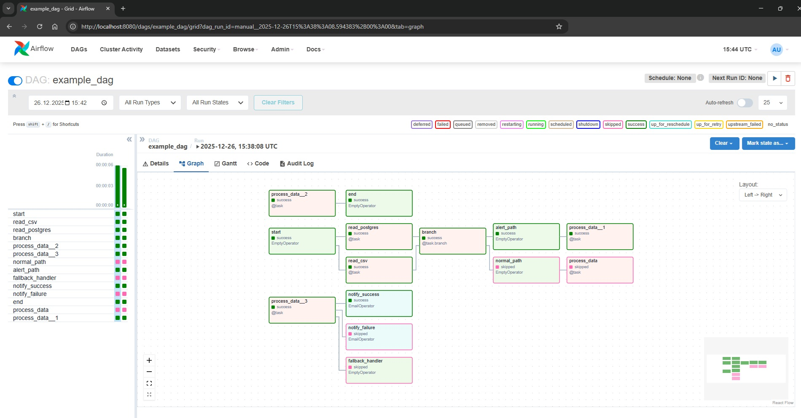
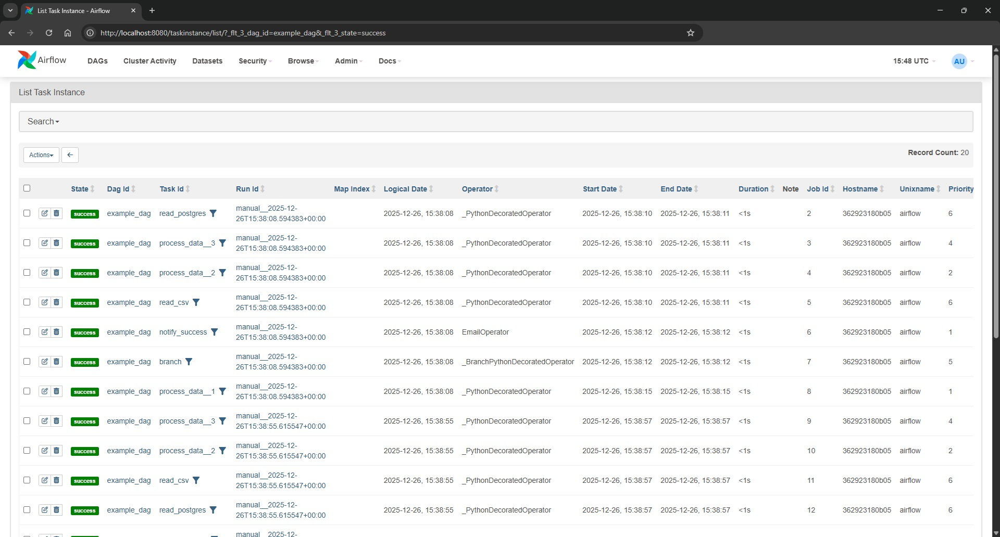
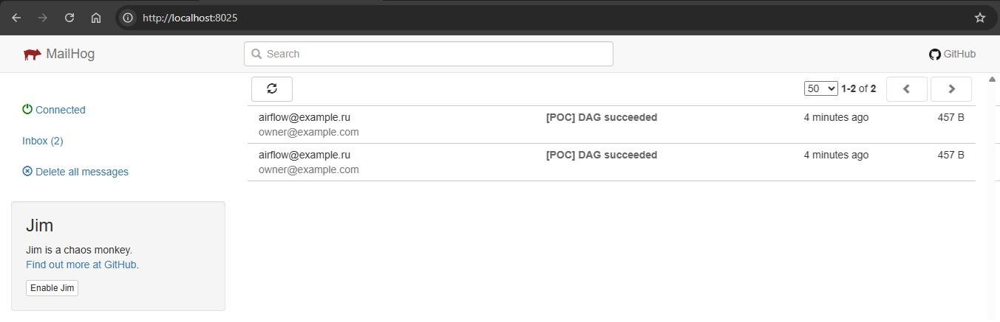

В качестве решения предлагается использовать Apache Airflow.

# Обоснование

Гибкие пайплайны (DAG-и, ветвление, условные операторы, циклы): BranchPythonOperator, ShortCircuitOperator, TaskGroup, @task.

## Запуск

1. Запустите инфраструктуру:
   ```bash
   docker-compose up -d
   ```

2. Откройте http://localhost:8080 в браузере.
    ```
    Логин/пароль: admin / admin.
    ```
   
3. Найдите DAG example_dag в списке.
4. Убедитесь, что он активен (переключатель включен).
5. Нажмите "Trigger DAG" для запуска.
6. Отслеживайте выполнение в интерфейсе.
7. Просматривайте логи задач для деталей выполнения.






8. Проверьте MailHog для просмотра отправленных уведомлений.

