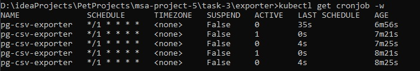
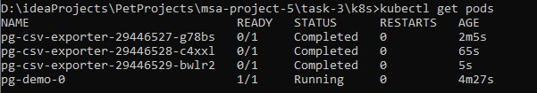
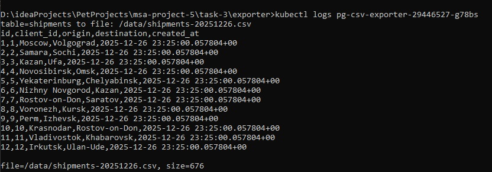

# Пакетная выгрузка данных из PostgreSQL в CSV

## Описание
Данный проект демонстрирует автоматическую ежеминутную выгрузку данных из таблицы PostgreSQL в формате CSV с использованием Kubernetes CronJob.

## Архитектура
- **PostgreSQL**: StatefulSet с инициализацией тестовой таблицы `shipments`.
- **Java-экспортёр**: Приложение, подключается к БД и экспортирует данные в CSV.
- **CronJob**: Планирует запуск экспортёра по расписанию.
- **Secrets/ConfigMaps**: Хранение учетных данных и конфигурации.

## Файлы
## Файлы
- [`Main.java`](../exporter/Main.java) — исходный код Java-приложения.
- [`Dockerfile`](../exporter/Dockerfile) — сборка образа.
- [`pg-demo.yaml`](../k8s/pg-demo.yaml) — запуск PostgreSQL.
- [`secret-postgres.yaml`](../k8s/secret-postgres.yaml) — учетные данные БД.
- [`pg-demo-init-cm.yaml`](../k8s/pg-demo-init-cm.yaml) — SQL-скрипт инициализации.
- [`configmap.yaml`](../k8s/configmap.yaml) — конфигурация экспорта.
- [`secret.yaml`](../k8s/secret.yaml) — учетные данные для подключения к БД из CronJob.
- [`cronjob.yaml`](../k8s/cronjob.yaml) — запуск Java-экспортёра.

## Exporter
Сервис на Java который:

- считывает настройки из окружения,
- подключается к БД,
- делает запрос,
- создает CSV файл,
- сохраняет файл в директории из переданных настроек,
- пишет в консоль содержимое файла (для демонстрации).

## Запуск
   
1. Собрать Docker-образ   

   ```bash
   cd task-3/exporter
   docker build -t pg-csv-exporter:0.1 .
   ```
   
2. Запустить Minikube и загрузить в него образ:

   ```bash
   minikube start
   minikube image load  pg-csv-exporter:0.1
   ```
   
3. Применить манифесты

   ```bash
   cd task-3/k8s
   kubectl apply -f pg-demo-init-cm.yaml
   kubectl apply -f secret-postgres.yaml
   kubectl apply -f pg-demo.yaml
   kubectl apply -f configmap.yaml
   kubectl apply -f pg-demo-secret.yaml
   kubectl apply -f cronjob.yaml
   ```
   
4. Дождаться запуска PostgreSQL 
 
   ```bash
   kubectl wait --for=condition=ready pod -l app=pg-demo --timeout=300s
   ```

5. Проверить CronJob

   ```bash
   kubectl get cronjob
   ```
   
   

6. После запуска Job можно посмотреть логи

   ```bash
   kubectl get pods
   kubectl logs <имя_pod_экспортёра>
   ```
   
   

   