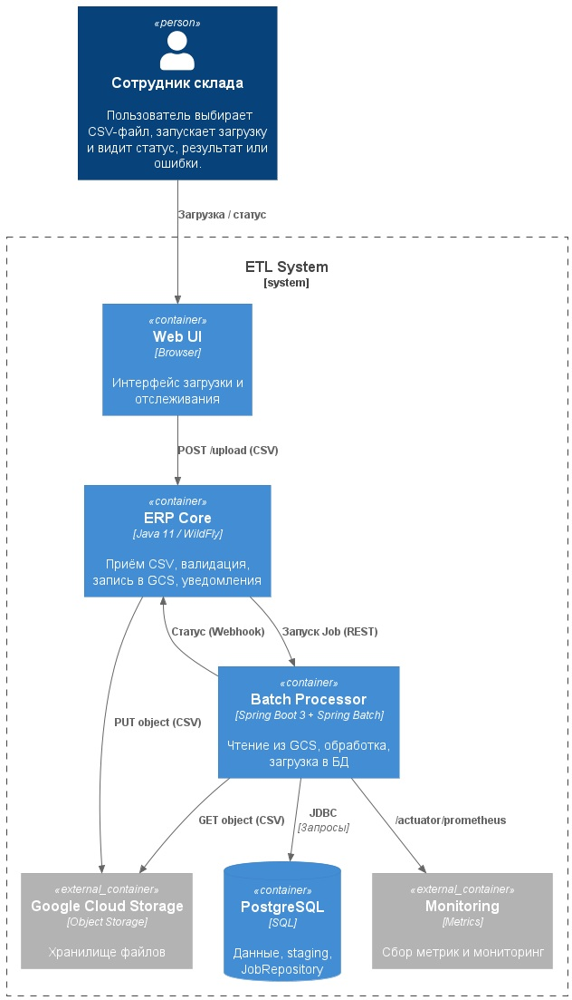

**Название задачи:** Реализация ETL с использованием Spring Batch

**Автор:** Алексей Тимофеев

**Дата:** 28.12.2025

**Функциональные требования**

| **№** | **Действующие лица или системы** | **Use Case**       | **Описание**                                                                              |
|:-----:|:---------------------------------|:-------------------|:------------------------------------------------------------------------------------------|
|   1   | Сотрудник склада (Web UI)        | Загрузка CSV в ERP | Пользователь выбирает CSV-файл, запускает загрузку и видит статус, результат или ошибки.  |

**Нефункциональные требования**

| **№** | **Требование**                                                                                                 |
|:-----:|:---------------------------------------------------------------------------------------------------------------|
|   1   | Производительность: Обработка файла до 2000 строк не более 30 секунд, поддержка 100-150 параллельных загрузок. |
|   2   | Масштабируемость: Возможность масштабировать ETL-воркеры независимо от других компонентов.                     |
|   3   | Надёжность: Возможность безопасного повторного запуска, целостность данных в транзакциях, контроль нагрузки.   |
|   4   | Совместимость: Работа с текущими технологиями: Java 11, WildFly/монолит, PostgreSQL, GCS, Docker/Compose, GCP. |
|   5   | Наблюдаемость: Сбор логов, метрик (Micrometer/Prometheus) и трассировок (OpenTelemetry).                       |

**Решение**

Spring Batch используется как отдельный ETL-сервис.
Монолит принимает CSV-файлы и сохраняет их в GCS.
ETL-сервис читает файлы из GCS, проводит валидацию и обогащение данных, затем загружает их в PostgreSQL.
Метаданные о выполнении задач хранятся в той же БД.
Запуск обработки возможен через REST API, по сообщению или по расписанию.
Для мониторинга используются Prometheus/Grafana и централизованные логи (EFK/Cloud Logging).

Обоснование:

- наличие опыта у команды снижает риски внедрения.
- масштабируемость за счёт запуска параллельных задач на нескольких воркерах.
- надёжность обеспечивается транзакциями, обработкой ошибок (retry/skip) через JobRepository.
- встроенные интеграции с Actuator, Micrometer, OpenTelemetry.

**Альтернативы**

|                                | Плюсы                              | Минусы                                   |
|--------------------------------|------------------------------------|------------------------------------------|
| Apache Airflow                 | оркестрация DAG, Python-операторы  | требует Python-стека и интеграции с JVM  |

**Недостатки, ограничения, риски**

- возможны блокировки при вставке данных, влияющие на производительность основной системы.
- масштабирование ограничено производительностью БД и пулом соединений.