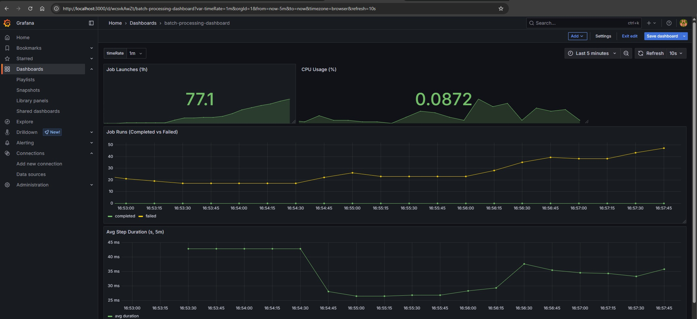
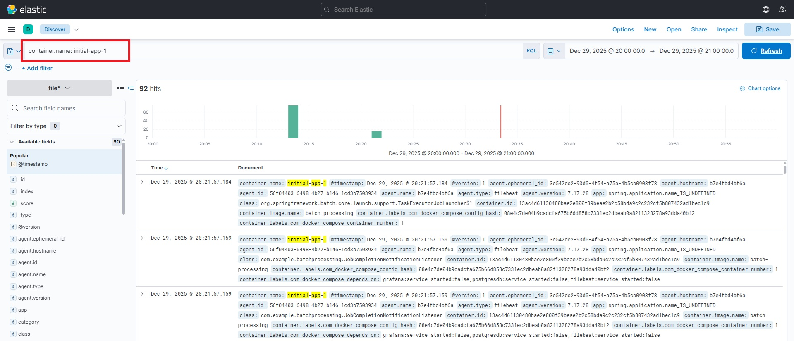

## Обоснование добавления средств мониторинга и логирования

В проект были включены следующие компоненты:

### Prometheus
Система сбора и хранения временных рядов метрик. Периодически опрашивает сервисы (например, `/actuator/prometheus` у Spring Boot) и собирает показатели (нагрузка, время отклика, состояние БД, статус Spring Batch-job).

**Преимущество:** предоставляет единое временное окно для анализа производительности и состояния системы, позволяет выявлять аномалии и тенденции.

### Grafana
Инструмент визуализации. Строит интерактивные дашборды на основе данных из Prometheus (JVM, Spring Batch, HTTP-запросы, ошибки).

**Преимущество:** предоставляет наглядную "оперативную сводку" для разработчиков и операторов, упрощает анализ и принятие решений.

### Filebeat
Лёгкий агент доставки логов. Считывает stdout/stderr контейнеров и отправляет их в центральный лог-сборник (Logstash/Elasticsearch).

**Преимущество:** централизованная, агностическая (не зависит от кода приложения) сборка логов с минимальной нагрузкой на сервисы.

### Logstash
Процессор логов. Получает данные от Filebeat, парсит JSON, фильтрует, обогащает метаданными (например, метки Docker), и отправляет в Elasticsearch.

**Преимущество:** гибкая предобработка и структурирование логов перед индексацией, улучшает качество данных и поиск.

### Elasticsearch + Kibana
Полнотекстовый поисковый движок и веб-интерфейс для него.

- **Elasticsearch** — хранит и индексирует логи для быстрого поиска.
- **Kibana** — предоставляет интерфейс для поиска, анализа и визуализации логов.

**Преимущество:** быстрая диагностика проблем по ключевым словам/ошибкам, построение лог-дашбордов и аудит событий.

## Итог

Добавленные инструменты обеспечивают:

- **Реальную наблюдаемость:** доступ к метрикам и логам в режиме реального времени.
- **Оперативное реагирование:** автоматические уведомления о проблемах через Alertmanager.
- **Глубокий анализ:** возможность отслеживать производительность Batch-процессов и всего приложения.
- **Централизованное управление:** единое место для мониторинга и анализа всех компонентов системы.

Это **повышает общую надёжность, упрощает отладку и сокращает время простоя**.

## Воспроизведение работы

1.  Запустите проект с помощью `docker-compose up`.
2.  Выполните HTTP-запрос `POST http://localhost:8080/launchJob` для запуска ETL-процесса.
3.  **Просмотрите метрики в Grafana:**
    - Откройте `http://localhost:3000`.
    - Войдите (логин/пароль: `admin`/`admin`).
    - Перейдите в "Explore" или откройте созданный дашборд.
    - Выберите источник данных Prometheus.
    - Наблюдайте за метриками JVM, Spring Batch, HTTP-запросами и состоянием БД.

4.  **Просмотрите логи в Kibana:**
    -   Откройте `http://localhost:5601`.
    -   Перейдите в "Discover".
    -   Создайте индекс, соответствующий логам вашего приложения (например, `filebeat*`).
    -   Используйте поисковый запрос для фильтрации (например, `container.name: initial-app-1` или `"msg":"!!! JOB FINISHED! Time to verify the results").
    -   Наблюдайте за логами приложения в реальном времени.

